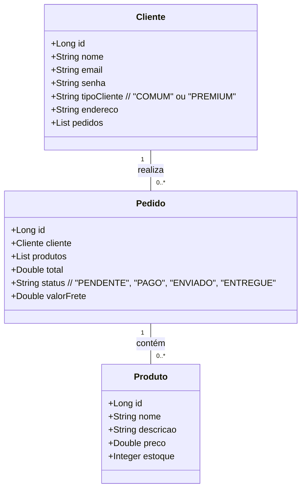

# 🚀 MarketFast

## 📌 Descrição

O **MarketFast** é um marketplace desenvolvido em **Spring Boot** que permite que clientes realizem pedidos de produtos, diferenciando-se por dois tipos de clientes:

-  **Premium**: tem direito a **frete grátis**.
-  **Comum**: paga pelo **frete**.

O objetivo do **MarketFast** é fornecer uma **API eficiente e estruturada** para gerenciar o cadastro de clientes, produtos e pedidos, garantindo **regras de negócio bem definidas** e uma experiência otimizada para os usuários.

---

---
## 🛠 Tecnologias Utilizadas

-  **Java 17**
-  **Spring Boot**
-  **Gradle** (Gerenciador de dependências)
-  **Banco de Dados H2** (Para desenvolvimento)
-  **Banco de Dados PostgreSQL** (Para produção, hospedado no Railway)
-  **Swagger** (Para documentação e testes de API)
-  **Postman** (Para testes manuais) 

---

## 📜 Regras de Negócio

-  Todo cliente precisa se cadastrar informando **nome** e **tipo** (**PREMIUM** ou **COMUM**).
-  Os clientes **PREMIUM** têm **frete grátis** ao realizar pedidos.
-  Os clientes **COMUNS** **pagam pelo frete**.

---

📢 **Projeto desenvolvido como parte do desafio da DIO em parceria com a AVANADE Decola Tech [MARKETFAST](https://diodecolatechmarketfast-production.up.railway.app/swagger-ui/index.html).** 🚀
