```mermaid
classDiagram
    class Cliente {
        +Long id
        +String nome
        +String email
        +String senha
        +String tipoCliente  // "COMUM" ou "PREMIUM"
        +String endereco
        +List<Pedido> pedidos
    }

   

    class Produto {
        +Long id
        +String nome
        +String descricao
        +Double preco
        +Integer estoque
        
    }

    class Pedido {
        +Long id
        +Cliente cliente
        +List<Produto> produtos
        +Double total
        +String status // "PENDENTE", "PAGO", "ENVIADO", "ENTREGUE"
        +Double valorFrete
    }

    Cliente "1" -- "0..*" Pedido : realiza
    Pedido "1" -- "0..*" Produto : contém
    
```

# 🚀 MarketFast

## 📌 Descrição

O **MarketFast** é um marketplace desenvolvido em **Spring Boot** que permite que clientes realizem pedidos de produtos, diferenciando-se por dois tipos de clientes:

-  **Premium**: tem direito a **frete grátis**.
-  **Comum**: paga pelo **frete**.

O objetivo do **MarketFast** é fornecer uma **API eficiente e estruturada** para gerenciar o cadastro de clientes, produtos e pedidos, garantindo **regras de negócio bem definidas** e uma experiência otimizada para os usuários.

---

---
## 🛠 Tecnologias Utilizadas

-  **Java 17**
-  **Spring Boot**
-  **Gradle** (Gerenciador de dependências)
-  **Banco de Dados H2** (Para desenvolvimento)
-  **Banco de Dados PostgreSQL** (Para produção, hospedado no Railway)
-  **Swagger** (Para documentação e testes de API)
-  **Postman** (Para testes manuais) 

---

## 📜 Regras de Negócio

-  Todo cliente precisa se cadastrar informando **nome** e **tipo** (**PREMIUM** ou **COMUM**).
-  Os clientes **PREMIUM** têm **frete grátis** ao realizar pedidos.
-  Os clientes **COMUNS** **pagam pelo frete**.

---

📢 **Projeto desenvolvido como parte do desafio da DIO em parceria com a AVANADE Decola Tech [MARKETFAST](https://diodecolatechmarketfast-production.up.railway.app/swagger-ui/index.html).** 🚀
